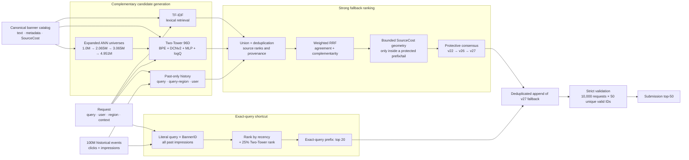

# ML Camp 2026 RecSys

Репозиторий решения задачи retrieval/ranking рекламных баннеров: по запросу и
контексту пользователя нужно вернуть ровно 50 уникальных `BannerID`. Основная
метрика — **SourceCost Recall@50**: recall кликов, взвешенный на `SourceCost`.

Лучший проверенный результат решения — **71.24% private SC Recall@50**
(`Recall@50 = 60.98%`). Путь от исходного TF-IDF baseline —
**21.51% → 71.24%, +49.73 п.п.**

В Git хранятся код, конфиги, тесты, небольшие отчёты и манифесты. Датасеты,
эмбеддинги, чекпойнты и submission parquet намеренно исключены.

## Архитектура финального решения



Главная идея — не найти одну «лучшую модель», а собрать несколько
**комплементарных ранжированных пулов**. Нужный баннер, не попавший в candidate
set, уже не спасёт ни один ranker. Поэтому сначала расширяется и объединяется
retrieval universe, затем согласие источников учитывается через rank fusion, а
дорогие и рискованные перестановки ограничиваются небольшой частью списка.

Финальный шаг `v31` ставит первые 20 баннеров из истории всех показов для
точно совпавшего запроса, ранжируя их по свежести с 25% примесью семантического
Two-Tower rank. Оставшиеся позиции дедуплицированно заполняются сильным
fallback `v27`.

## Модели и источники кандидатов

| Компонент | Что делает | Что важно запомнить |
|---|---|---|
| **TF-IDF** | Ищет баннеры по лексическому сходству query с title/text | Сильный на точных словах, артикулах и редких токенах; слаб как единственный retrieval, но сохраняет уникальные попадания для ансамбля. |
| **Two-Tower baseline** | Два простых tower из Linear-слоёв, ANN по общему embedding space | Хорошая отправная точка, но малая выразительность и sampled-softmax bias ограничивали recall. |
| **Two-Tower v3/v7** | BPE 16,384; отдельные embeddings query/title/text/region/banner/context; 4 DCNv2 cross-слоя + 3 residual MLP; 96D; multi-positive contrastive loss | DCNv2 моделирует явные feature crosses, MLP — гладкие нелинейности. Большой batch 4,096 дал сильный hard-negative signal. Standalone private был лишь 58.85–60.00%, но модель резко усилила ансамбль благодаря новым кандидатам. |
| **Two-Tower logQ / v17** | Корректирует sampled-softmax на частоту показа баннера; финальная версия использует точный global train-only prior | Batch-frequency logQ дал полезную комплементарность; exact global logQ оказался намного сильнее приближённого prior. Важно считать prior только на разрешённом прошлом. |
| **История query/query-region** | Возвращает ранее кликнутые баннеры по exact query и query-region, сортируя по clicks, SourceCost, recency или mean SourceCost | Только события с `event_time < request_time`. Query-SourceCost был полезнее user/region/global history. Снятие ограничения старого 1M index открыло новые BannerID. |
| **Exact-query impressions** | Берёт все баннеры, когда-либо показанные по literal query, включая некликнутые | Самый сильный поздний источник. Raw exact покрывал около 70% test; нормализация добавила лишь 3 запроса. Лучший порядок: recency + 25% Two-Tower, prefix 20. |
| **CatBoost ranker** | QueryRMSE/YetiRank/QuerySoftMax над retrieval ranks, agreement, text, context, banner metadata и past-only counters | Хорошо улучшал top-1/top-5, но почти не менял candidate ceiling. 37→276 признаков и 8 CG ухудшили качество: больше фич не равно лучше. В позднем решении ranker был вспомогательным pool, а не источником главного скачка. |
| **DCNv2 second-stage ranker** | Listwise reranking 159 leakage-safe признаков с residual blend | Отвергнут: raw temporal SC@50 **67.27% → 56.79%, −10.48 п.п.**; residual `alpha=0.02` дал **−0.41 п.п.** full и провалил late gate. |
| **Expanded ANN indexes** | Переэмбеддит bounded train-only подмножества большого каталога тем же Two-Tower checkpoint | Рост 1.065M→2.065M дал большой выигрыш без переобучения. Следующие расширения добавлялись по popularity/SourceCost и использовались защитным blend, а не прямой заменой. |
| **RRF + protective fusion** | Объединяет позиции, а не несопоставимые raw scores; сохраняет верх списка и меняет только разрешённый tail | Слабый standalone pool может улучшить итог, если его ошибки отличаются. Поздние `v26/v27` меняли только ranks 11–50 или 41–50, снижая риск. |
| **SourceCost geometry** | Мягко домножает fused score на функцию SourceCost внутри top-N | Это небольшая поправка, не сортировка «по самой высокой цене». Работала только bounded: например exponent 0.10–0.25 внутри top 75/100. |

## Как собирался fallback

1. Ранние независимые pools — old walk-forward, chronological ensemble и
   Two-Tower v7 — объединялись weighted RRF с весами `0.10/0.30/0.60`,
   `RRF K=10`, затем применялась мягкая `SourceCost^0.1` геометрия в top-75.
2. Exact global-logQ Two-Tower и расширение ANN universe вывели систему из
   диапазона 65% к 68–70%.
3. `v22` консервативно смешал proxy, 3.065M и 4.951M rankings с весами
   `0.40/0.20/0.40`, `RRF K=30`, exponent `0.25`, top-75.
4. `v26` сохранил top-10 `v22`, а ranks 11–50 заполнил RRF-consensus
   `v21 + v22`.
5. `v27` сохранил первые 40 позиций `v26`, а последние 10 заполнил
   value-aware RRF из `v26 + v20`.
6. `v31` поставил exact-query impression prefix 20 перед `v27` и дал лучший
   private score **71.24%**.

## Проверенные private milestones

Все изменения ниже — абсолютные процентные пункты SourceCost Recall@50 на
private leaderboard. Строки отражают последовательные принятые решения, а не
идеальную изолированную абляцию.

| Версия / идея | Было → стало | Δ |
|---|---:|---:|
| Исходный TF-IDF baseline | — → **21.51%** | — |
| Воспроизводимый I0: TF-IDF + Two-Tower + history + RRF/CatBoost | 21.51% → **58.36%** | **+36.85 п.п.** |
| 100M chronological history + ranker | 58.36% → **61.71%** | **+3.35 п.п.** |
| Bounded SourceCost geometry | 61.71% → **61.84%** | **+0.13 п.п.** |
| QueryRMSE ranker | 61.84% → **62.06%** | **+0.22 п.п.** |
| QueryRMSE + YetiRank rank-level ensemble | 62.06% → **62.16%** | **+0.10 п.п.** |
| Chronological cross-pool | 62.16% → **62.62%** | **+0.46 п.п.** |
| Three-pool RRF с Two-Tower v7 | 62.62% → **64.99%** | **+2.37 п.п.** |
| Небольшая примесь refined CatBoost pool | 64.99% → **65.01%** | **+0.02 п.п.** |
| 10% logQ Two-Tower | 65.01% → **65.45%** | **+0.45 п.п.** |
| Лучший pre-global-logQ proxy | 65.45% → **65.48%** | **+0.03 п.п.** |
| Exact global-logQ v17 | 65.48% → **67.09%** | **+1.61 п.п.** |
| Full-catalog query history v18 | 67.09% → **67.56%** | **+0.47 п.п.** |
| Targeted ANN 1.065M v19 | 67.56% → **67.67%** | **+0.11 п.п.** |
| Targeted ANN 2.065M v20 | 67.67% → **68.86%** | **+1.19 п.п.** |
| Protective 3.065M/4.951M blend v22 | 68.86% → **69.88%** | **+1.02 п.п.** |
| Consensus tail v26 | 69.88% → **69.91%** | **+0.03 п.п.** |
| Protected value tail v27 | 69.91% → **70.05%** | **+0.14 п.п.** |
| Exact-query impressions + semantic rank v31 | 70.05% → **71.24%** | **+1.19 п.п.** |

## Другие важные гипотезы

| Гипотеза | Результат | Решение |
|---|---:|---|
| Two-Tower: 2 Linear → 4 DCNv2 + 3 MLP | **45.27% → 51.83%, +6.56 п.п. offline** | Принята как архитектурная основа. |
| Chronological вместо shuffled Two-Tower training | **49.99% → 53.88%, +3.89 п.п. offline** | Принято; порядок времени важнее случайного split. |
| CatBoost над I0 RRF | **61.09% → 62.24%, +1.15 п.п. offline** | Полезен, особенно в начале списка. |
| 37→276 признаков + 8 CG | **62.24% → 61.60%, −0.64 п.п. offline** | Отклонено; candidate ceiling также упал 70.49%→68.68%. |
| CatBoost + RRF blend | **63.69% → 64.37%, +0.67 п.п. offline** | Принят принцип rank-level blending. |
| SourceCost-weighted CatBoost | **63.69% → 63.30%, −0.40 п.п. offline** | Отклонено; лучше мягкая post-ranking геометрия. |
| 10M weekly OOF вместо 100M history | **58.18% → 56.07%, −2.11 п.п. private** | Отклонено: уменьшение истории не quality-neutral. |
| Two-Tower v7 standalone | **58.85–60.00% private** против 64.99% ensemble | Не заменяет ансамбль; используется как complementary pool. |
| TF-IDF lexical tail v24/v25 | **69.88% → 69.88% / 69.87%, 0.00 / −0.01 п.п. private** | Отклонено: bootstrap CI касался нуля. |
| DCNv2 second-stage raw | **67.27% → 56.79%, −10.48 п.п. offline** | Быстро отклонено temporal gate. |
| Exact-query clicks-only | **70.05% → 70.23%, +0.18 п.п. private** | Полезно, но не объясняет большой скачок. |
| Exact-query all impressions, pure recency, prefix 30 | **70.05% → 70.90%, +0.85 п.п. private** | Сильный резервный вариант. |
| 7-day clicks + 25% model, exact prefix 20 | **70.05% → 71.01%, +0.96 п.п. private** | Сильный, но ниже recency+model. |
| All impressions: recency + 25% model, prefix 20 | **70.05% → 71.24%, +1.19 п.п. private** | Финальный лучший вариант. |
| CatBoost внутри exact pool / `h500 + exact` | learned rankers не превзошли simple hybrid offline | Отклонено; простой prior оказался устойчивее. |
| Нормализация exact query | покрыла лишь **+3 из 10,000** test requests | Для этих данных несущественна. |
| User/region/global history | user: 0 новых holdout hits; region: 0 уникальных hits; query-region+global ≈0.04% unique SC | Не добавлять CG без измеренной complementarity. |

Подробный разбор последней гипотезы: [docs/exact_query_impression_study.md](docs/exact_query_impression_study.md).

## Leakage-safe validation contract

- Фиксированный temporal split: **6,499 fit / 3,500 holdout** по request group;
  boundary `2026-06-21 15:36:57 UTC`.
- Для counters/history всегда выполняется `event_time < request_time`;
  события с тем же timestamp не видят друг друга.
- Offline и full/test scopes имеют разные пути и fingerprints; артефакты между
  ними не смешиваются.
- Candidate pool естественный: clicked target не инжектируется в candidates.
- Гипотеза принимается по early/late/full SC@50, Recall@50, SC@500,
  complementarity и paired bootstrap, а не по одной точке.
- Перед submission проверяются ровно 10,000 `HitLogID`, ровно 50 уникальных
  валидных `BannerID`, отсутствие null/unknown/short rows и SHA-256.

## Что переносить в следующее соревнование

1. **Сначала candidate ceiling и unique hits, потом ranker.** Ranker не найдёт
   объект, отсутствующий в пуле.
2. **Комплементарность важнее standalone score.** Слабая модель полезна, если
   приносит другие правильные кандидаты.
3. **Смешивать ranks, а не raw scores.** RRF устойчив к разным шкалам TF-IDF,
   neural retrieval и history priors.
4. **Сначала искать shortcuts в структуре данных.** Exact query × all
   impressions дал больше большинства сложных ranker-экспериментов.
5. **Расширять ANN universe ступенчато.** Проверять каждый tranche по двум
   половинам времени и использовать protective blend, если direct ranking
   ухудшает верх списка.
6. **Не оптимизировать только целевой вес в loss.** SourceCost weighting
   ухудшал CatBoost; bounded post-rank correction была стабильнее.
7. **Хранить принятый top-N.** Рискованные идеи применять к tail, если top-10
   или top-40 уже сильны.
8. **1M = smoke, 10M = gate, 100M = только победителям.** При этом нельзя
   заменять полную историю первыми 10M событиями: sampling gradient updates и
   history coverage — разные вещи.
9. **Профилировать весь pipeline.** В этом проекте merge/feature materialization
   были дороже CatBoost; после кэширования warm ranker probe занимал минуты.

## Репозиторий

```text
configs/                 # composed experiment configs and temporal split
src/mla_recsys/          # pipeline, candidate generators, features, rankers
scripts/                 # orchestration, audits, materializers, validation
yql/                     # reproducible train-only/history aggregations
tests/                   # leakage, parity, schema and strict-output tests
docs/architecture.md     # detailed data/artifact contracts
docs/plan.md             # chronological experiment journal with all evidence
docs/exact_query_impression_study.md
```

Базовые команды на VM:

```bash
cd ~/workspace/mla_two_stage_accel
PY=/home/astrofimuk/workspace/step2_ce/.venv/bin/python

$PY -m pytest tests -q
$PY scripts/run_pipeline.py experiment=i0_reproduce \
  run_id=<YYYYMMDD_HHMM_name> mode=offline
```

Каждый run пишет resolved config, git state, input/output fingerprints,
stage timings, metrics и manifests в `runs/<run_id>/`. Полные команды и
правила воспроизводимости: [docs/commands.md](docs/commands.md),
[docs/architecture.md](docs/architecture.md), [docs/arch-rules.md](docs/arch-rules.md).
